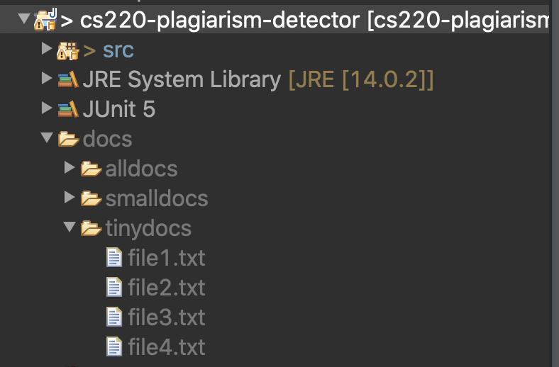

Plagiarism Detector
==

This assigned is based on [this "nifty" assignment](http://nifty.stanford.edu/2008/franke-catch-plagiarists/)

Code
===
The code is [on github here](https://github.com/jspacco/cs220-plagiarism-detector). Fork the repo!

There is an API (basically, an interface) for you to implement called `IPlagiarismDetector`. Your code goes in `PlagiarismDetector`.

Documents
===
There are 1,800 documents, ranging from a few dozen words to over 1,000 words, with about 418 words the average length of a document.

Some notes on the data format:
* The documents are split into sentences, with one sentence per line.
* Treat punctuation as a separate word. This is a common approach when processing text.
* Process the sentences one at a time. This means that n-grams should not "span" a line. So once you get to the end of a line of text, stop processing, read the next line, and start again.
    * An easy way to do this is with a `Scanner` and a while loop using the `hasNextLine()` and `nextLine()` methods.
    * Convert each line you've read with the `Scanner` into `String[]` like this: `line.split(" ")` and then you can write for loops to go through the array.
* If any line has fewer words than the number of n-grams (so a sentence with 2 words when N is 3), just skip it. Real data is messy and we have to make decisions like this all the time; it will be fine.

The documents for testing are NOT stored in the Github repo. This is because it is not a good practice to store lots of data on Github. Instead, find the documents on [Google Drive here](https://drive.google.com/file/d/10AM2DyjpUpodCfFYzxNS5NIqx1D95eGB/view?usp=sharing).

Download the zipfile, and then extract or unzip it into your Eclipse project. It should look like this:

Your Eclipse folder structure **`must look exactly like this`**. If you have an extra folder, so it's "docs/docs/tinydocs" instead of "docs/tinydocs", then you have to fix it by moving folders around. (This often happens when extracting on Windows.) If your extracted/unzipped documents are not in your Eclipse folder, none of the test cases will be able to find them.

What to submit
===
* A link to your Github repo
* A Google Doc that answers the following questions:
    * Which documents, if any, seem like they were plagiarized?
    * What values of N did you try, and what effects did you observe from these different values?
    * What was a good threshold for number of n-grams in common for two documents to seem suspicious?
        * Remember, the documents vary in length, so having a fixed number of n-grams in common does not automatically mean there was plagiarism! It just means the documents seem suspicious and require a human to look at them.
    * What kind of runtimes are you looking at to process all 1800 documents? It takes about a minute on my machine.
